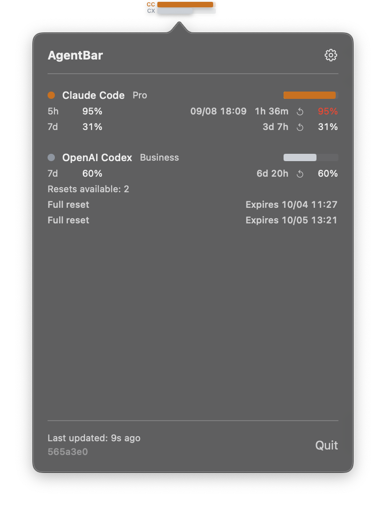

# AgentBar

<p align="center">
  
</p>

여러 AI 코딩 도구의 사용량을 한곳에서 확인하는 macOS 메뉴 막대 앱입니다.

이 저장소는 [scari/AgentBar](https://github.com/scari/AgentBar)를 수정한 [WoojinByun의 포크](https://github.com/WoojinByun/AgentBar)입니다. 아래 변경사항은 기본 브랜치인 **`main`**에 포함되어 있습니다. 이 버전과 설치 안내를 공유하려면 저장소 첫 화면의 링크를 전달하면 됩니다.

## 이 포크에서 달라진 점

- 로컬 세션 기록으로 사용량을 추정하지 않고, 새로고침할 때마다 인증된 Codex App Server에서 실제 한도 사용량을 조회합니다.
- 서버가 제공하는 한도 기간을 그대로 표시합니다. 주간 한도만 있는 계정은 불필요한 `5h` 행 없이 `7d`만 표시합니다.
- 사용 가능한 Codex 한도 초기화권(리셋권) 개수와 서버가 반환한 만료 시각을 보여줍니다. 조회만 수행하며, 초기화권을 사용하거나 모델 작업을 시작하지 않습니다.
- 조회에 실패하면 마지막으로 확인한 Codex 사용량이 오래된 값임을 명확히 표시합니다.
- `5h` 행에는 남은 시간 옆에 초기화 시각을 현지 시간대 기준 `MM/dd HH:mm` 형식으로 표시합니다.
- 상세 팝업 너비를 350pt로 조정하고, 앱 안의 Buy Me a Coffee 버튼을 제거했습니다.

<p align="center">
  
</p>

이 포크의 실행 화면입니다. 사용량, 초기화권 개수, 만료 시각은 계정과 조회 시점에 따라 달라집니다.

화면의 `Resets available`은 남은 초기화권 개수, `Full reset`은 전체 초기화권, `Expires`는 만료 시각을 뜻합니다.

## 지원 서비스

| 서비스 | 데이터 출처 |
|---------|-----------|
| Claude Code | Anthropic OAuth API(키체인에 저장된 인증 정보) |
| OpenAI Codex | Codex App Server의 실제 사용량 및 사용 가능한 초기화권(ChatGPT 계정으로 로그인한 Codex CLI 필요) |
| Google Gemini | 로컬 로그(`~/.gemini/tmp/`) |
| GitHub Copilot | GitHub Copilot API(키체인에 저장된 PAT) |
| Cursor | Cursor API 및 로컬 SQLite 데이터베이스 |
| Z.ai | Z.ai 한도 API(키체인에 저장된 API 키) |

## 주요 기능

- 메뉴 막대에 사용량순으로 정렬된 막대 표시
- 상세 팝업에서 서비스별 사용량 확인
- 에이전트 이벤트에 대한 데스크톱 알림(Claude 훅, Codex 감시 기능)
- 새로고침 주기 설정 및 서비스별 켜기·끄기
- 요금제·한도 설정 및 API 키 관리
- CESP 레지스트리를 통한 사운드 팩 지원
- 알림 전달 후 사용자 지정 알림음 재생, 재생 실패 시 기본 알림음 사용

<a id="install"></a>

## 설치

아래 절차에 따라 이 포크의 소스를 직접 빌드합니다. **원본 저장소의 DMG에는 이 포크의 변경사항이 포함되어 있지 않습니다.** 이 안내로 만드는 앱은 로컬 임시 서명(ad-hoc)이 적용된 앱이며, Apple 공증을 받은 배포본은 아닙니다. 유료 Apple Developer 계정은 필요하지 않습니다.

### 1. 준비사항

- AgentBar 실행에는 macOS 13 이상이 필요합니다. 사용하는 Xcode 버전에 따라 더 최신 macOS가 필요할 수 있습니다.
- Swift 6을 지원하는 정식 Xcode를 Mac App Store 또는 [Apple 개발자 다운로드](https://developer.apple.com/download/all/)에서 설치합니다. 이 안내는 macOS 15.7.4와 Xcode 16.3에서 검증했습니다. Command Line Tools만 설치한 환경에서는 빌드할 수 없습니다.
- Codex 사용량을 보려면 ChatGPT 계정으로 로그인한 Codex CLI가 필요합니다(4단계 참고).

Xcode를 한 번 실행해 이용 약관 동의와 추가 구성요소 설치를 마친 뒤, 터미널에서 선택된 개발 도구 경로를 확인합니다.

```sh
xcode-select -p
xcodebuild -version
```

경로가 Xcode가 아닌 `/Library/Developer/CommandLineTools`로 나온다면 정식 Xcode 설치 경로를 선택합니다. 다른 위치에 설치했다면 경로를 바꿔 주세요.

```sh
sudo xcode-select --switch /Applications/Xcode.app/Contents/Developer
```

Xcode 프로젝트 파일은 저장소에 포함되어 있으므로 설치를 위해 XcodeGen을 추가로 설치할 필요는 없습니다.

### 2. main 브랜치 복제 및 빌드

소스를 보관할 디렉터리에서 터미널을 열고 아래 명령을 실행합니다. 오류가 발생하면 다음 단계로 넘어가지 말고 먼저 해결해 주세요.

```sh
git clone --single-branch --branch main https://github.com/WoojinByun/AgentBar.git
cd AgentBar
xcodebuild build -project AgentBar.xcodeproj -scheme AgentBar -configuration Debug -derivedDataPath build CODE_SIGN_IDENTITY=- CODE_SIGN_STYLE=Manual DEVELOPMENT_TEAM= -quiet
```

빌드된 앱은 `build/Build/Products/Debug/AgentBar.app`에 생성됩니다. 이후 명령도 복제한 저장소 디렉터리에서 실행합니다.

### 3. 설치 및 실행

관리자 권한이 필요 없는 사용자별 응용 프로그램 폴더(`~/Applications`)에 설치합니다. 기존 AgentBar가 실행 중이라면 먼저 종료해 주세요. 아래 명령은 이전 실행 인스턴스를 종료하고, 설치 위치에 기존 앱이 있으면 백업한 뒤 새 앱을 복사합니다.

```sh
(
set -e
test -x build/Build/Products/Debug/AgentBar.app/Contents/MacOS/AgentBar
pkill -x AgentBar || true
mkdir -p "$HOME/Applications"
if [ -e "$HOME/Applications/AgentBar.app" ]; then
    agentbar_backup_dir="$(mktemp -d "$HOME/Applications/AgentBar-backup.XXXXXX")"
    mv "$HOME/Applications/AgentBar.app" "$agentbar_backup_dir/AgentBar.app"
fi
ditto build/Build/Products/Debug/AgentBar.app "$HOME/Applications/AgentBar.app"
open -g "$HOME/Applications/AgentBar.app"
)
```

AgentBar는 메뉴 막대 앱이므로 일반 앱 창이 열리지 않습니다. 화면 상단의 사용량 막대를 누르면 상세 팝업이 열리고, 톱니바퀴 아이콘을 누르면 설정으로 이동합니다. 설정에서 사용하는 서비스만 켜고 나머지는 꺼 주세요.

`/Applications`에 원본 AgentBar가 별도로 설치되어 있다면 그 앱을 실행하지 않도록 주의하세요. 위의 정확한 경로로 실행하고, 기존 로그인 항목이 이전 설치본을 자동으로 실행하지 않는지도 확인해 주세요.

### 4. 계정 연결

**Codex**

이미 정상 동작하는 Codex CLI가 있다면 기존 설치를 그대로 사용하고 설치 명령은 건너뛰세요. 없다면 [공식 Codex CLI 설치 안내](https://developers.openai.com/codex/cli/)의 독립 실행형 설치 프로그램을 사용할 수 있습니다. Homebrew나 Node.js는 필요하지 않습니다.

```sh
curl -fsSL https://chatgpt.com/codex/install.sh | sh
export PATH="$HOME/.local/bin:$PATH"
```

API 키가 아닌, 사용량을 확인하려는 ChatGPT 계정으로 로그인합니다.

```sh
codex --version
codex login
codex login status
```

브라우저 로그인이 요청되면 완료해 주세요. `codex login status`에 원하는 ChatGPT 계정의 로그인 상태가 이미 표시된다면 다시 로그인할 필요는 없습니다. 연동은 Codex CLI `0.153.4`에서 검증했으며, App Server의 `account/rateLimits/read` 기능이 필요합니다. CLI는 최신 상태로 유지해 주세요.

AgentBar 설정에서 OpenAI Codex를 켜고 다음 새로고침을 기다립니다. 기존 CLI 로그인을 그대로 사용하므로 AgentBar에 토큰을 붙여 넣을 필요가 없습니다. 과거 로컬 Codex 세션 기록도 필요하지 않습니다. 화면의 백분율은 **이미 사용한 비율**입니다. 예를 들어 공식 대시보드에 66% 남음으로 표시되면 여기서는 34% 사용으로 표시됩니다. 초기화권 상세 정보는 서버가 해당 정보를 반환할 때만 나타납니다.

**Claude Code**

이 Mac에서 Claude Code에 한 번 로그인한 뒤, AgentBar 설정에서 Claude Code를 켭니다. AgentBar는 macOS 키체인에 저장된 기존 OAuth 인증 정보를 읽습니다. macOS가 키체인 접근 허용 여부를 물으면, AgentBar가 해당 인증 정보를 읽도록 허용하려는 경우 승인해 주세요.

다른 서비스는 설정에서 개별적으로 연결할 수 있습니다. Claude 또는 Codex 사용량만 확인한다면 다른 서비스 설정은 필요하지 않습니다.

### 기존 설치 업데이트

2단계에서 복제한 저장소 안에서 실행합니다.

```sh
git pull --ff-only origin main
xcodebuild build -project AgentBar.xcodeproj -scheme AgentBar -configuration Debug -derivedDataPath build CODE_SIGN_IDENTITY=- CODE_SIGN_STYLE=Manual DEVELOPMENT_TEAM= -quiet
```

두 명령이 모두 성공하면 3단계를 다시 실행해 설치된 앱을 교체하고 재실행합니다. **빌드만 해서는 Applications에 설치된 앱이 업데이트되지 않습니다.** Git이 로컬 변경사항이나 브랜치 분기를 알리면 먼저 해결하세요. 업데이트를 위해 작업 내용을 무작정 버리지 마세요.

### 문제 해결

- **계속 이전 화면이 보일 때:** `git branch --show-current` 결과가 `main`인지 확인하고, 빌드·설치를 다시 한 뒤 `~/Applications/AgentBar.app`을 정확히 지정해 실행하세요. 팝업 하단의 빌드 커밋 해시를 `git rev-parse --short HEAD` 결과와 비교할 수 있습니다. 이전 `WoojinByun/AgentBar` 브랜치를 복제했다면 다른 상위 디렉터리에서 2단계에 따라 새로 복제하세요. 기존 복제본의 로컬 변경사항은 보관합니다.
- **`xcodebuild`가 Xcode를 요구하거나 Swift 컴파일 오류가 날 때:** 1단계를 확인하고 Swift 6을 지원하는 정식 Xcode를 사용하세요.
- **서명 과정에서 개발 팀을 요구할 때:** 서명 설정 3개가 포함된 위의 Debug 빌드 명령을 그대로 사용하세요. 릴리스 스크립트는 서명·공증 배포용이며 이 설치에는 필요하지 않습니다.
- **Codex 사용량을 조회할 수 없을 때:** `command -v codex`, `codex --version`, `codex login status`를 실행해 ChatGPT 로그인, 네트워크 연결, App Server 한도 조회를 지원하는 CLI 버전을 확인하세요. CLI를 설치하거나 업데이트한 뒤에는 AgentBar를 재실행하세요.
- **터미널에서는 Codex가 되는데 AgentBar에서는 안 될 때:** GUI 앱의 `PATH`는 터미널과 다를 수 있습니다. AgentBar는 `~/.local/bin`, `/opt/homebrew/bin`, `/usr/local/bin`, 표준 `~/.nvm/versions/node/*/bin` 설치 경로도 확인합니다. 별도 경로에 설치했다면 지원되는 설치 위치를 사용하세요.
- **Codex에 오래된 값이라는 경고가 표시될 때:** 최근 조회가 실패해 마지막 성공 시점의 값을 보여주는 것입니다. 현재 한도가 여전히 소진됐다는 뜻은 아닙니다. 로그인과 네트워크 연결을 확인한 뒤 다음 조회가 성공하는지 확인하세요.

<a id="build"></a>

## 개발용 빌드 및 테스트

개발 중에는 2단계와 같이 빌드한 뒤, 실행 중인 AgentBar를 종료하고 빌드 디렉터리의 앱을 직접 실행할 수 있습니다.

```sh
open -g build/Build/Products/Debug/AgentBar.app
```

저장소 루트에서 테스트를 실행합니다.

```sh
# Test (recommended: serial workers, no system keychain integration tests)
./scripts/test.sh

# Optional: run with system keychain integration test enabled
AGENTBAR_RUN_SYSTEM_KEYCHAIN_TESTS=1 ./scripts/test.sh
```

참고:

- `scripts/test.sh`는 macOS 보안 확인창이 반복해서 뜨는 것을 줄이기 위해 기본적으로 `-parallel-testing-enabled NO`와 작업자 수 `1`을 사용합니다.
- 시스템 키체인 통합 테스트는 기본적으로 제외되며, `AGENTBAR_RUN_SYSTEM_KEYCHAIN_TESTS=1`로 명시적으로 켤 수 있습니다.

## 원본 프로젝트 후원

AgentBar의 원작자는 [scari](https://github.com/scari)입니다. 아래 링크는 이 포크가 아닌 원본 프로젝트 제작자를 후원하는 링크입니다.

[](https://github.com/sponsors/scari)
[](https://buymeacoffee.com/_scari)

## 라이선스

MIT 라이선스를 따릅니다. 자세한 내용은 [LICENSE](LICENSE)를 확인하세요.
